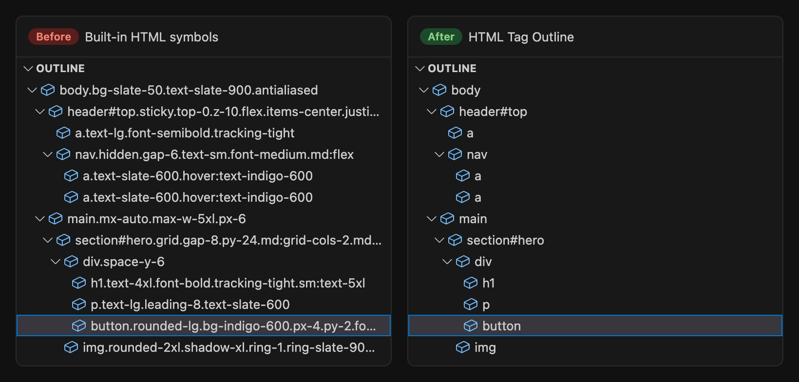
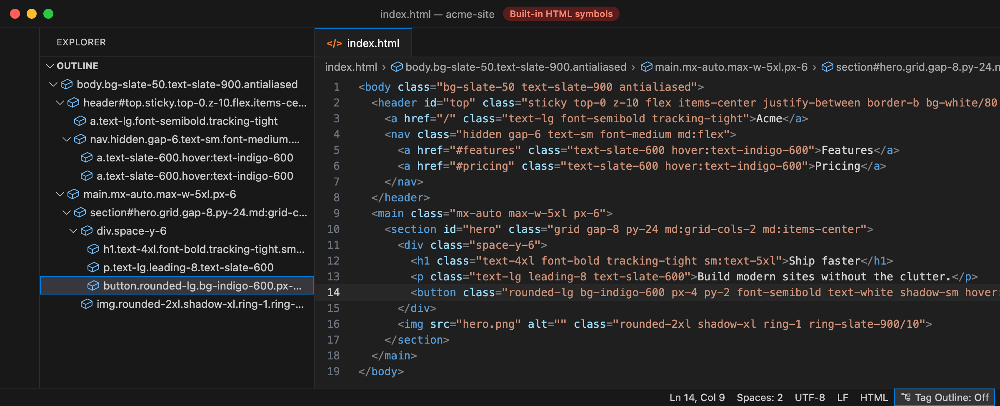
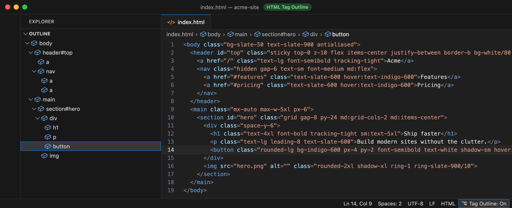

# HTML Tag Outline

[](https://github.com/paeduh/html-tag-outline/actions/workflows/ci.yml)
[](LICENSE)

A VS Code extension that gives HTML files a readable **Outline** and **Breadcrumbs**. It lists each element by its tag name and optional `#id`, and leaves out the class list.



## Features

- **Tag-only symbols** in the Outline view, Breadcrumbs and Go to Symbol (<kbd>Cmd</kbd>/<kbd>Ctrl</kbd>+<kbd>Shift</kbd>+<kbd>O</kbd>).
- **Optional `#id`** after the tag name, so landmarks like `section#pricing` are easy to find.
- **Status bar toggle** to switch between this view and the built-in one.
- **HTML-aware nesting**: handles void elements, self-closing tags, implied end tags (`<li>`, `<p>`, `<td>`, `<option>`, …) and ignores markup inside `<script>` and `<style>`.
- **Fast and lightweight**: no runtime dependencies, one pass over the file, results cached per document version.
- **Optional timing log** to check how long parsing takes on your files.

## Why it helps with Tailwind CSS

VS Code's built-in HTML outline names each element `tag#id.class1.class2…`. That's fine with a few semantic class names. With utility-first CSS such as [Tailwind CSS](https://tailwindcss.com), UnoCSS or Bootstrap utilities, every element carries a long list of classes and the outline turns into this:

```text
section#hero.grid.gap-8.py-24.md:grid-cols-2.md:items-center
  div.space-y-6
    h1.text-4xl.font-bold.tracking-tight.sm:text-5xl
    button.rounded-lg.bg-indigo-600.px-4.py-2.font-semibold.text-white.shadow-sm…
```

Rows get cut off, sibling elements look alike, and the breadcrumb bar runs out of room after two or three levels. The page structure the Outline is supposed to show gets buried under styling.

With HTML Tag Outline the same markup reads like this:

```text
section#hero
  div
    h1
    button
```

The classes stay in your code where you need them. The Outline and Breadcrumbs go back to showing structure, and the full path fits in the breadcrumb bar: `body › main › section#hero › div › button`.

| Built-in HTML symbols                                  | HTML Tag Outline                                      |
| ------------------------------------------------------ | ----------------------------------------------------- |
|  |           |

## Installation

Install **HTML Tag Outline** from the Extensions view (<kbd>Cmd</kbd>/<kbd>Ctrl</kbd>+<kbd>Shift</kbd>+<kbd>X</kbd>), or run:

```sh
code --install-extension paeduh.html-tag-outline
```

You can also download a `.vsix` from [GitHub Releases](https://github.com/paeduh/html-tag-outline/releases) and install it with **Extensions: Install from VSIX…**.

## Usage

1. Open an `.html` file.
2. Open the **Outline** view in the Explorer sidebar, or turn on **View › Appearance › Breadcrumbs**.

No setup is needed. The extension turns on whenever an HTML file opens, for both saved and untitled documents.

### Status bar toggle

While an HTML file is active, a status bar item on the right shows the current mode:

- **Tag Outline: On**: Outline and Breadcrumbs show tag-only symbols.
- **Tag Outline: Off**: the extension stops providing symbols, so you see VS Code's built-in outline with all its classes.

Click the item to switch. This is useful when you want to see an element's classes for a moment and then go back to the clean view. The toggle writes `htmlTagOutline.enabled` to your user settings, so your choice is kept across windows and restarts. The Command Palette command **HTML Tag Outline: Toggle** does the same.

## Settings

| Setting                    | Default | Description                                                                                   |
| -------------------------- | ------- | --------------------------------------------------------------------------------------------- |
| `htmlTagOutline.enabled`   | `true`  | Provide tag-only symbols. When `false`, only the built-in HTML symbols are shown.             |
| `htmlTagOutline.showId`    | `true`  | Append `#id` to the tag name when the element has an `id` attribute, e.g. `section#hero`.     |
| `htmlTagOutline.logTiming` | `false` | Write file size, element count and parse time to the **HTML Tag Outline** output channel.     |

### Performance logging

Parsing is fast, and the result is cached for each document version. Switching between the Outline, Breadcrumbs and Go to Symbol reuses the cached result, and nothing is parsed again until you edit the file.

If you want to check the numbers, for example on a very large or generated file:

1. Set `"htmlTagOutline.logTiming": true`.
2. Open **View › Output** and choose **HTML Tag Outline** from the dropdown.
3. Open or edit an HTML file. Each parse adds one line:

   ```text
   index.html: parsed, 42 KB, 1318 elements, 3.4 ms
   ```

   - **42 KB**: size of the document (UTF-8).
   - **1318 elements**: number of elements found, which is the number of Outline entries.
   - **3.4 ms**: time taken to parse and build the symbol tree.

Cached results aren't logged, so no new line means nothing had to be parsed again. Turn the setting off again for everyday use. Parse errors are always written to the same channel, whatever this setting is.

## Limitations

- Works only for the `html` language mode (`.html`, `.htm`, …). Vue, Svelte, JSX/TSX, Blade and other template languages aren't covered.
- Only the `id` attribute is shown. Classes are left out on purpose; use the toggle when you need to see them.

## Feedback and contributing

Bug reports and contributions are welcome.

- **Found a bug?** [Open an issue](https://github.com/paeduh/html-tag-outline/issues/new/choose) and include a small HTML snippet that reproduces it.
- **Have an idea?** Open a feature request.
- **Want to send a fix?** See [CONTRIBUTING.md](CONTRIBUTING.md) for setup, tests and pull request guidelines.

## License

[MIT](LICENSE) © Patrick Hofer
